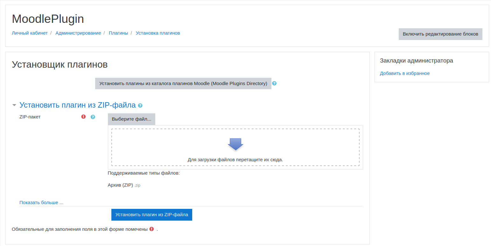
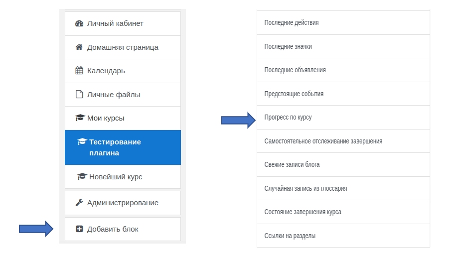
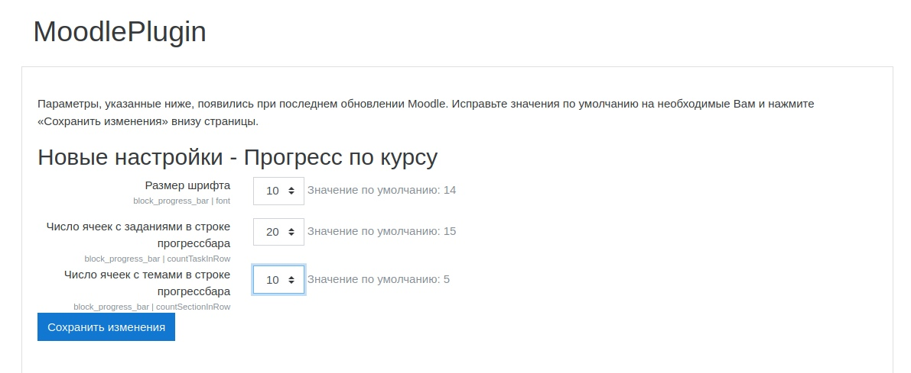
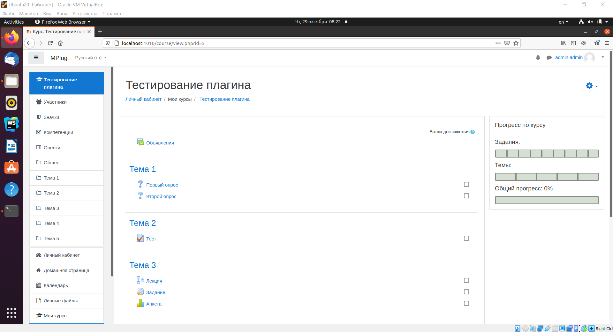

# mse_course_progress_plugin

Ссылка на трело:
https://trello.com/b/lk8wESLA/moodle

---
# Для установки плагина необходимо:
*   Загрузить архив с плагином на сайт moodle

---
*   Выбрать “Добавить блок” в режиме редактирования своего курса и выбрать из списка плагин “Прогресс по курсу”

---
*   Выбрать необходимые настройки

---
*   После выполненных действий на вашем курсе появится блок, отображающий прогресс по вашему курсу

---
